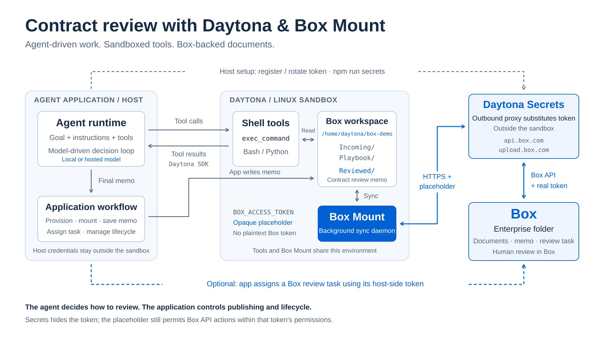

# Box Mount Contract Review on Daytona

[Box Mount](https://developer.box.com/guides/box-mount) connects a local directory
to a Box folder. An agent works with files through familiar shell tools, while
Box Mount handles the API calls that synchronize documents and results with Box.

[Daytona](https://www.daytona.io/docs/en/) provides the remote Linux sandbox for
those tools. The application runs on your host, provisions the sandbox, and
keeps the Box token outside it using Daytona Secrets.

In this demo, an agent examines a synthetic contract and legal playbook, then
returns a review memo for the application to publish to Box. The architecture
separates the agent runtime from its execution environment; the included
implementation uses an OpenAI model with shell tools running in Daytona.

## Prerequisites

- Node.js 22+ and npm on your host.
- A [Daytona API key](https://app.daytona.io/dashboard/keys) with permission to
  manage sandboxes and register secrets.
- An empty Box folder for the demo and its folder ID.
- A Box Developer Token with access to that folder.
- An OpenAI API key for the included reviewer.
- A supplied Linux x86_64 Box Mount archive from the
  [Box Mount preview](https://developer.box.com/guides/box-mount).

The sandbox is remote; you do not need a local container runtime. Developer
Tokens are temporary demo credentials and expire after about an hour.

## Setup

### 1. Configure the application

From your project checkout, install dependencies and create the configuration:

```bash
npm install
cp .env.example .env
chmod 600 .env
```

Open `.env` in your editor and provide `DAYTONA_API_KEY`, `BOX_ACCESS_TOKEN`,
`BOX_FOLDER_ID`, and `OPENAI_API_KEY`. The doctor, seed, and demo commands
require these values before creating a sandbox. Keep `.env` on the host;
it is ignored by Git and is not uploaded by the application.

Set `BOX_REVIEWER_USER_ID` if you want the application to assign the finished
memo to a Box user. Without it, the workflow ends with the memo.
`OPENAI_MODEL` is optional and defaults to `gpt-5.5`. Other configuration
options are covered in the [appendix](#configuration-and-custom-snapshots).

### 2. Add the Box Mount archive

Place the supplied `.tar.gz` or `.tgz` archive in `private/`. The binary
is private-preview software and is not shipped with this repository.

When that directory contains exactly one archive, its name does not matter.
For multiple archives or another location, set `BOX_MOUNT_ARCHIVE` in `.env`
to the one you want to use.

Reusable setup uploads the archive only when the sandbox lacks Box Mount,
then records its version. Later reviews check that version and skip the upload;
they do not require the local archive. Doctor and seed still install into their
own temporary sandboxes. Supply the Linux x86_64 build even when your host uses
another operating system or CPU architecture.

### 3. Register the Box secret

```bash
npm run secrets
```

This host-side command reads `BOX_ACCESS_TOKEN` from `.env` and creates or
updates the Daytona organization secret `box-mount-token`. It restricts
credential substitution to `api.box.com` and `upload.box.com`. It does not
start a sandbox or test whether Box accepts the token.

Registration requires `manage:secrets`; attaching the secret during sandbox
creation requires `write:sandboxes`. Missing or inaccessible secrets cause
creation to fail—there is no fallback that sends the plaintext token.

Inside Daytona, `BOX_ACCESS_TOKEN` contains a `dtn_secret_...` placeholder.
The outbound proxy replaces it with the real token in HTTPS headers sent to
the secret's approved hosts. The host keeps its own token for account checks
and optional review-task assignment. See
[Daytona Secrets](https://www.daytona.io/docs/en/secrets/) for the proxy behavior.

The diagram separates agent decisions, application-controlled actions, and
credential substitution outside the sandbox:



The agent is shown without a model-provider dependency. A local model could
occupy that architectural role, but this demo does not include a local-model
configuration switch. Secrets protects the token itself, not the scope of
Box actions available through its placeholder.

## Run

Use the following commands from the project directory on your host. The review
sandbox is saved in `.demo-state.json` and reused across requests. Do not delete
that file to start another review. Doctor and seed remain temporary operations.

### 1. Check the configuration

```bash
npm run doctor
```

The doctor checks local fixtures and host-side Box account/folder access.
It creates a temporary sandbox to verify that the environment contains a
secret placeholder, an authenticated Box API request succeeds through the
proxy, and the Box Mount executable runs. It also checks the host's OpenAI
key and access to the configured model.

These checks do not mount the folder, verify document synchronization, or run
model inference. The temporary sandbox is deleted afterward.

### 2. Populate the Box workspace

```bash
npm run seed
```

Seeding creates a temporary sandbox, mounts your Box folder, and copies the
sample contract and playbook into the mounted directory. It creates a
`Reviewed/` directory for the output, then requests a final sync, unmounts,
and deletes the sandbox.

The workspace layout is:

```text
Incoming/Acme-MSA.docx
Playbook/approved-contract-playbook.md
Reviewed/
```

The application writes ordinary files; Box Mount uploads them. While mounted,
changes made in Box also flow back into the sandbox workspace.

### 3. Prepare the reusable sandbox

```bash
npm run setup
```

This creates the sandbox, installs Box Mount, and mounts the Box folder without
running the agent. It saves the sandbox ID before installation, so an upload
failure can be inspected and retried without automatically creating another
sandbox. Installation logs distinguish archive upload, installer upload, and
execution. The initial archive transfer still needs to succeed once.

Running setup again reconnects to the saved sandbox. A stopped or archived
sandbox is started; an installed binary is reused. Box Mount status is checked:
a running mount with the expected path and Box folder is reused without unmounting
or repeating bootstrap. If no mount exists, one is created. An unhealthy,
unrecognized, or failed status check stops setup and retains the sandbox for inspection.

### 4. Start or repeat the contract review

```bash
npm run demo
```

The application reuses the saved sandbox and checks the Box mount at
`/home/daytona/box-demo`. If setup has not been run, it performs setup first.
Box Mount continuously synchronizes the running mount; this check confirms a
running daemon, not that every remote change has already arrived locally.
The agent is given the review goal and source paths,
not pre-extracted document contents. It selects shell commands to inspect the
files, extracts DOCX text using Python, and compares the agreement against the
playbook. Command results feed back into the loop so it can adjust its next
action.

The agent loop runs on your host; its commands run in Daytona. This implementation
sends text returned by those commands to OpenAI. The terminal prints tool-call
arguments and completion status as the review proceeds.

The agent returns a Markdown memo. Application code writes it to
`Reviewed/Acme-MSA-review.md` for Box Mount to synchronize. Open the memo in
Box to check the result. If you configured a reviewer, the application also
attempts to create and assign a Box review task; that action is not an agent
tool call.

Run `npm run demo` again for another review using the same sandbox and installed
binary. Each run starts a fresh agent conversation, reviews the same configured
contract, and replaces the same memo; a configured reviewer can receive another
task. This is workspace reuse, not persistent conversation memory or a
multi-contract request API.

### 5. Inspect the running sandbox

```bash
npm run status
```

This reconnects to the saved sandbox and displays mount status and workspace
listings. It does not restart a stopped sandbox or extend its lifetime.

For interactive exploration, select the printed sandbox ID in the
[Daytona dashboard](https://app.daytona.io/dashboard/sandboxes) and open its
terminal or filesystem tools. Inspect `/home/daytona/box-demo`, or edit a
synthetic document there and observe the synchronized change in Box.

### 6. Stop between sessions, or delete when finished

To retain the installed environment without leaving it running:

```bash
npm run stop
```

This completes a final sync and unmount, then stops the sandbox while retaining
its filesystem and saved ID. If final sync fails, it does not stop or delete the
sandbox. There is no Box synchronization while stopped. `npm run demo` or
`npm run setup` starts it again and remounts the folder.

To permanently remove the sandbox instead:

```bash
npm run teardown
```

Teardown attempts a final sync and unmount, deletes the sandbox, and clears the
local session record. Files already synchronized to Box remain there. If
unmounting fails, teardown warns and still proceeds with deletion; unsynchronized
changes may be lost. If deletion fails, it retains the session record for retry.

The reusable sandbox has no automatic expiry or idle stop. Running resources
continue to incur charges until you stop or delete it; retained storage remains
subject to Daytona's policies. The Box token still expires independently.

The fixtures and generated memo are for demonstration only. A qualified legal
professional must review any findings before they are used.

## Appendix

### Credentials and permission boundaries

Keep the Daytona and OpenAI keys on the host. The application does not share
the project checkout or `.env` with the sandbox; it uploads the installer,
Box Mount archive, fixtures during seeding, and the final memo.

The agent's shell runs as the same `daytona` user as Box Mount. That user has
passwordless sudo in the expected image. Instructions to avoid writes, network
access, and credentials are prompts, not enforced tool permissions. The mounted
directory is a working directory, not a filesystem confinement boundary.

The placeholder can authenticate requests to allowed Box hosts with the token's
permissions. `BOX_FOLDER_ID` selects a mount; it does not limit the token's API
authority. Use synthetic files and a dedicated Box identity with limited access.
The secret host allowlist controls credential substitution, separately from
the sandbox's network allowlist.

Daytona secrets are organization-scoped. A principal with `write:sandboxes`
can attach organization secrets even without `manage:secrets`. Consider a
dedicated organization for the demo, and never remove the secret host allowlist.
See [Daytona's permissions guidance](https://www.daytona.io/docs/en/secrets/#permissions).

### Token rotation and authentication failures

After replacing a Box Developer Token in `.env`, run:

```bash
npm run secrets
npm run doctor
```

Editing `.env` alone does not rotate the stored secret. Updating
`box-mount-token` affects every sandbox using it; Daytona applies the new
value to outbound requests within seconds. This demo does not implement
automatic OAuth or JWT token refresh.

If host-side Box checks pass but sandbox authentication fails, check the
registered secret, permitted hosts, network access, and certificate handling.
The doctor's `users/me` check confirms proxy authentication, not Box Mount's
complete download/upload path. If an additional endpoint needs credential
substitution, verify it before changing the hosts in `src/box-secret.ts` and
rerunning `secrets`. Do not disable TLS verification.

A sandbox created before the Secrets migration can retain its old plaintext
environment. Finish synchronization and tear it down before creating a fresh
one; reconnecting does not sanitize an existing sandbox.

### Agent implementation and limits

- `src/contract-agent.ts` defines the review instructions, agent runner,
  tool-event logging, and final memo publication.
- `src/agent-sandbox.ts` connects the agent's shell capability to the existing
  Daytona sandbox.
- `src/reusable-sandbox.ts` handles setup, reconnect, installation checks,
  mount health checks/reuse, and safe stop; `src/state.ts` records progress and locks commands.
- `src/run-review-job.ts` checks input/output files and coordinates optional
  task assignment through `src/box.ts`.

The runner allows up to 20 model turns and uses a five-minute cancellation
signal. Individual shell calls have a 60-second timeout; returned output is
truncated to at most 64,000 characters. Interactive terminals and user-switch
requests through the adapter are unsupported.

Nonzero shell exits are returned to the agent so it can recover. Runner errors
or an empty final response fail the review rather than invoking a substitute
reviewer. The normal publication path requires a nonempty memo, but does not
prove that the agent read every source or produced legally correct findings.
The workflow checks for a nonempty local output after a short sync delay;
without task assignment, it does not independently confirm the upload via
the Box API.

Configured credentials are redacted from tool-argument logs, and tool output
bodies are not printed. Arguments can still contain document text, so protect
the logs. SDK tracing is disabled, but the model still receives inspected
document content.

### Configuration and custom snapshots

`DAYTONA_API_URL` selects a different Daytona endpoint, `DAYTONA_TARGET`
selects a region, and `DAYTONA_SNAPSHOT` selects an existing snapshot.
Otherwise, the SDK uses its defaults.

A custom snapshot needs x86_64 Linux, the `daytona` user, Bash, Python 3,
Node.js 20+, npm, curl, and passwordless sudo. The host still needs Node.js 22+.
The installer writes `/usr/local/bin/agent-mount` and creates the
`/usr/local/bin/box-mount` symlink expected by the preview build.
Mount state lives in `/home/daytona/.box-mount`.
See [Daytona's Box Mount guide](https://www.daytona.io/docs/en/mount-external-storage/#mount-a-box-folder).

### Sandbox lifetime and cleanup

The review sandbox uses `ttlMinutes: 0`, `autoStopInterval: 0`, and
`autoDeleteInterval: -1`. In Daytona, an auto-delete value of zero means delete
on stop, not disable deletion. Doctor and seed retain their five- and
fifteen-minute hard TTLs and explicit cleanup.

Failed setup or review commands retain the sandbox and its saved progress.
Retry setup after fixing installation or authentication. A failed mount is
recorded as uncertain: the next attempt checks live status, reuses a running
mount, or mounts if Box Mount explicitly reports no mount. Unhealthy or unknown
status never triggers an automatic unmount/reset. Run `npm run status` and inspect
`/home/daytona/.box-mount/logs` in Daytona before recovery; preserve any unsynced
documents. An externally stopped daemon may need manual recovery. `npm run stop`
still performs a graceful final sync and unmount before stopping the sandbox.

If the saved sandbox was deleted, `npm run teardown` clears its stale record;
then run setup again. Saved sessions from the old one-hour lifecycle require
explicit teardown and recreation, rather than silently retaining old credentials.
Changing `BOX_FOLDER_ID` while a session exists is rejected to avoid using the
wrong workspace. Changing a snapshot setting does not rebuild an existing sandbox.

Setup, review, stop, and teardown share a checkout-local `.demo-state.json.lock`
to prevent overlapping commands. An interrupted process can leave this lock.
Before manually removing it, verify the recorded PID is no longer running and
any remote command/upload has finished. Do not run concurrent requests from
another checkout or host against the same sandbox; this lock is not distributed.
Neither interruption nor stopping a sandbox directly in the dashboard guarantees
pending writes reached Box. Prefer `npm run stop` for a graceful stop.

### Offline verification

```bash
npm test
```

The suite runs TypeScript checks, mocked integration tests, and Python installer
tests. Python 3 is required for the installer tests. No live sandbox or API
credentials are needed. End-to-end validation requires your supplied archive
and working credentials, using the doctor, seed, demo, status, and teardown
commands above.

Project license metadata is `UNLICENSED`. Keep the preview archive and any
images containing it private.
